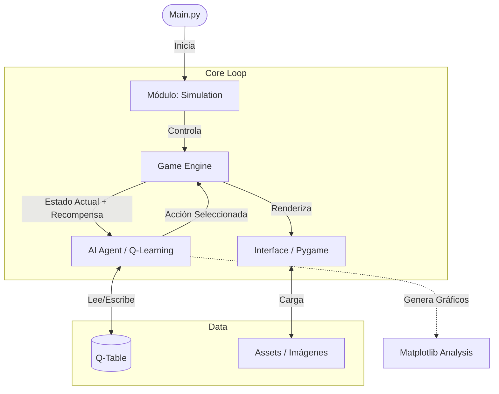

# TrustMeBro-AI 

**Proyecto de Inteligencia Artificial con Aprendizaje por Refuerzo (Q-Learning) y Pygame.**

Este proyecto implementa un agente autónomo capaz de aprender a navegar e interactuar en un entorno simulado mediante algoritmos de Q-Learning. El sistema visualiza el proceso de aprendizaje en tiempo real utilizando un motor gráfico propio.

---

##  Arquitectura del Proyecto

El sistema está diseñado de manera modular, separando la lógica de aprendizaje, el motor del juego y la interfaz gráfica.



### Descripción de Módulos
Basado en la estructura de archivos del repositorio:

*   **`ai_agent/`**: Cerebro del proyecto. Contiene la lógica de Q-Learning, la política de exploración/explotación y la actualización de la tabla Q.
*   **`game_engine/`**: Define las reglas del mundo, la física, las colisiones y el sistema de recompensas.
*   **`interface/`**: Maneja la visualización gráfica usando Pygame.
*   **`simulation/`**: Orquestador que conecta el agente con el motor del juego y gestiona los ciclos de entrenamiento.
*   **`assets/`**: Recursos gráficos (imágenes) utilizados por la interfaz.

---

## Instalación y Requisitos

El proyecto está desarrollado 100% en **Python**.

### Prerrequisitos
Asegúrate de tener Python instalado. Luego, instala las dependencias necesarias listadas en el repositorio:

```bash
# Clonar el repositorio
git clone https://github.com/ElGorel/TrustMeBro-AI.git
cd TrustMeBro-AI

# Instalar dependencias
pip install pygame
pip install matplotlib
pip install Pillow
```

---

##  Uso

Para iniciar la simulación y ver al agente aprendiendo en tiempo real, ejecuta el archivo principal desde la raíz del proyecto:

```bash
python main.py
```

El sistema abrirá una ventana de Pygame mostrando el entorno y, dependiendo de la configuración, generará gráficos de rendimiento con Matplotlib al finalizar o durante el entrenamiento.

---

## Estructura del Repositorio

```text
TrustMeBro-AI/
├── ai_agent/       # Algoritmos de IA
├── assets/         # Sprites e imágenes
├── game_engine/    # Lógica del juego
├── interface/      # Visualización y UI
├── simulation/     # Bucle principal
├── .gitignore      # Archivos excluidos
├── main.py         # Punto de entrada
└── README.md       # Documentación
```
---

*Desarrollado como parte de un proyecto de investigación en Inteligencia Artificial.*